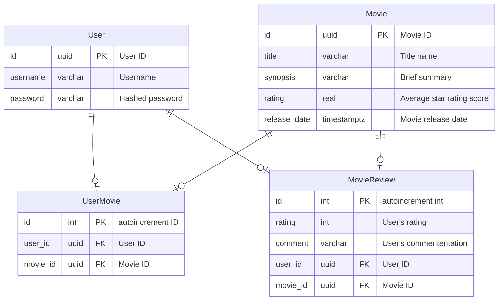

# NestJS Starter Pack

## Entity Diagram Design
- User: User account information. Each record contains a  `username` and a hashed `password`.
- Movie: Movie information.
- UserMovie: User favourite movies information. Each record stores `user_id` and `movie_id`. User can add as many movies as they want.
- UserMovie: User reviews information. Each record stores `user_id` and `movie_id`. User can add as many movies as they want but only one record is stored for each `movie_id`.


## Technology Stack

- Programming language: TypeScript 5.3.3
- Runtime environment: Node.js 18.13
- Web server framework: NestJS 10.3.1
- Database: PostgreSQL
- ORM library and migrations tool: TypeORM 0.3.20
- Testing framework: Jest 29.7.0
- API documentation: Swagger
 

## Prerequisites
### System Requirements
- One of these operating systems with the version or higher:
    - Windwos 11 ver. 22H2
    - Mac OS 13 (Ventura)
    - Ubuntu 20.04
- Node 18.13
- Docker Desktop
- (Optional) [Volta](https://volta.sh/). I find it really useful for managing Node.js runtime environment and package manager per project. The environment is defined in `package.json`.

### IDE Requirements
Visual Studio Code

### Environment Variables
Stored in `.env` file at the root folder. It's required by `./config/config.module.ts` when starting the server.

# Getting Started
1. Clone this repository, then run
```
yarn install
```
2. Start the database serve
```
docker-compose up -d
```
3. Run database migration
```
yarn typeorm migration:run -d .\src\ormconfig.ts
```
4. Not we can start the server
```
yarn start:dev
```
Voila! API server will now be available at `localhost:3000`. Since it also comes with Swagger UI you can go to `localhost:3000/docs` to interact with the API.

### Accessing protected resource
To access the protected resources, you must sign in via `/auth/sign-in` to obtain the access token, and then attach it to `Authorization` header with `Bearer <YOUR_ACCESS_TOKEN>`.
On Swagger UI you can just copy paste the access token by clicking the Authorize Button, or if you are using Postman then under the Authorization tab select Bearer Token and then paste the access token

# (Optional) Using pgAdmin
To make queries and view tables in the database, open a browser and go to `localhost:81`

For Email Address and Password, enter:
- Email Address: test@test.com
- Password: password

You are now connected to the dashboard. On the top-left corner, right-click the servers icon, `register` --> `server...`, it opens a configuration menu. To create a new database connection, use the following table to fill in the information.

| 項目 | 入力内容 |
| --- | --- |
| Name | local |
| Host name/address | postgres |
| Port | 5432 |
| Maintenance database | postgres |
| Username | postgres |
| Password | postgres |

# Development Guildeline
## Project Folder Structure
```
root/
├── config/
│   └── config.module.ts
├── src/
│   ├── auth/
│   │   ├── dto/
│   │   ├── request/
│   │   ├── auth.controller.ts
│   │   ├── auth.service.ts
│   │   └── auth.module.ts
│   ├── entities/
│   │   └── users.entity.ts
│   ├── migrations/
│   │   ├── .gitkeep
│   │   └── NewMigration__xxxxxxxx.ts
│   ├── models/
│   │   ├── user.model.ts
│   │   └── movie.model.ts
│   ├── movie-reviews/
│   │   ├── dto/
│   │   ├── request/
│   │   ├── response/
│   │   ├── movie.reviews.controller.ts
│   │   └── movie-reviews.module.ts
│   ├── movies/
│   │   ├── dto/
│   │   ├── request/
│   │   ├── response/
│   │   ├── movie.controller.ts
│   │   ├── movie.service.ts
│   │   └── movie.module.ts
│   ├── users/
│   │   ├── dto/
│   │   ├── request/
│   │   ├── response/
│   │   ├── users.controller.ts
│   │   ├── users.service.ts
│   │   └── user.module.ts
│   ├── app.module.ts
│   ├── main.ts
│   └── ormconfig.ts
└── .env
```
- `src/entities/`: Schema of the database table.
- `src/models/` : Data class object of the database table.
- `src/migrations`: Migration files generated from TypeORM.
- `src/*/dto`: Holds all the required parameters in one place to be consumed by the business logic for what data is required for requests.
- `src/*/request`: Recive parameters from the request and perform validation.
- `src/*/response`: Represent the JSON response to be returned to the client.

## Run these commands while working with the code!!
### Prettify code
```
yarn format
```

### Run Linter
```
yarn lint
```

### Run test
```
yarn test
```
